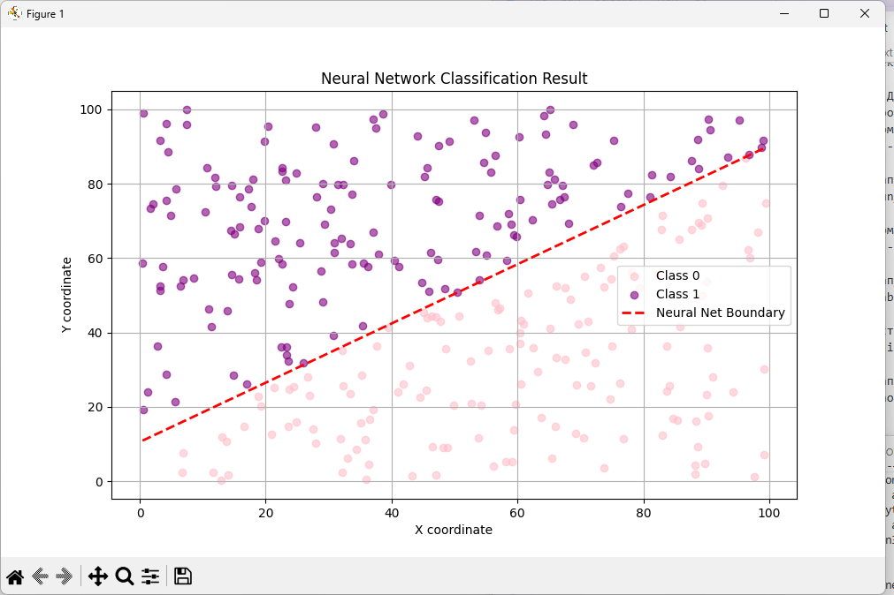
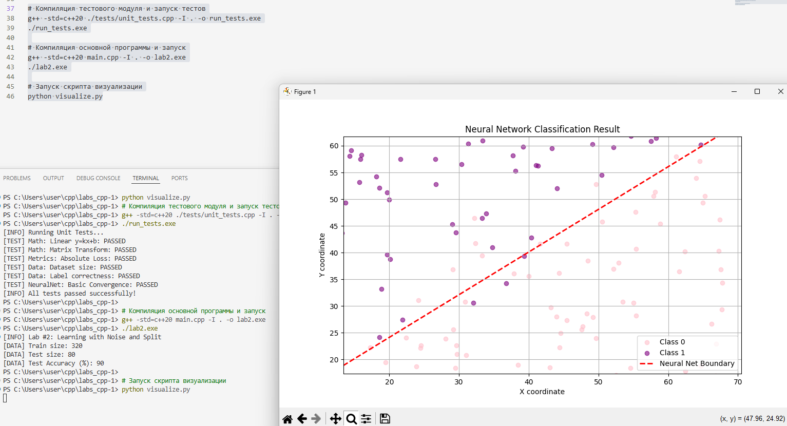

В ходе выполнения работы были произведены:

1. Замена классов на namespace

2. Создан новый файл: neural_net
Здесь мы реализуем класс перцептрона.
Он хранит веса, делает предсказания и обучается методом градиентного спуска.
Обновлены файлы main и visualize в соответсвии с новой структурой проекта. 

Было реализовано:

1.Генерация данных с шумом
Создали набор точек (x, y), разделенных прямой y = kx + b, добавили нормальное распределение (шум), 
которое слегка сдвигает координаты, чтобы проверить способность модели находить общую закономерность, а не просто запоминать координаты.
Примечание: Если noise_level слишком велик, классы перемешиваются так, что линейная разделимость становится невозможной, этот момент важно контролировать. 

2. Нормализация данных
Привели координаты из диапазона [0, 100] к диапазону [0, 1], чтобы веса (w_x, w_y) и смещение (bias) обучались с одинаковой скоростью.

3. Разделение датасета (80/20 для проверки обобщающей способности модели)

4. Инициализация весов и bias
Мы задали случайные стартовые значения для весов и смещения, это нулевое значение для модели. 
Сделано это, так как случайные числа позволяют избежать симметрии и дают нейрону возможность начать обучение из произвольного состояния.

5. Метод train
Запустили цикл эпох, где для каждой точки считали предсказание и, 
в случае ошибки, корректировали веса по специальной формуле. 
Это реализация алгоритма Розенблатта, нейрон постепенно разворачивает и двигает свою разделяющую прямую, пока количество ошибок не станет минимальным.
Мы выбрали его, потому что это базовый классический алгоритм для решения задач линейной классификации. Он идеально подходит для нашей лабораторной работы, так как:

- Он наглядно показывает принцип работы искусственного нейрона.

- Он математически прост и не требует вычисления сложных производных (как, например, метод обратного распространения ошибки).

- Для данных, которые можно разделить прямой линией, этот алгоритм гарантированно найдет решение.

Сильные стороны:
- Вычислительная простота
- Модель может дообучаться на лету. Если придет одна новая точка, нам не нужно переучивать всё заново,
достаточно один раз прогнать её через формулу коррекции весов.
- Скорость обучения
- Интуитивность. Легко отследить, как каждая ошибка влияет на наклон и положение прямой.

Слабые стороны
- Если данные нельзя разделить одной прямой, алгоритм никогда не остановится. 
- Чувствительность к шуму
- Отсутствие уверенности. Перцептрон выдает только 0 или 1.
- Остановка при первом успехе. Как только алгоритм нашел хоть какую-то линию, которая разделяет классы, он останавливается. 
Он не ищет самую лучшую линюю.

6. Визуализация

7. Тесты
Для обеспечения надежности кода мы допусали тесты. 
Сейчас они проверяют корректность матричных вычислений, генерацию данных и сходимость перцептрона на простейших примерах. 

При реализации neural_net мы использовали модификаторы доступа для реализации принципа инкапсуляции.
Параметры модели скрыты в секции private, чтобы предотвратить их некорректное изменение извне и скрыть внутреннюю логику хранения данных.
В секции public представлены методы для обучения и классификации.
Это делает код более безопасным, предсказуемым и удобным для поддержки

