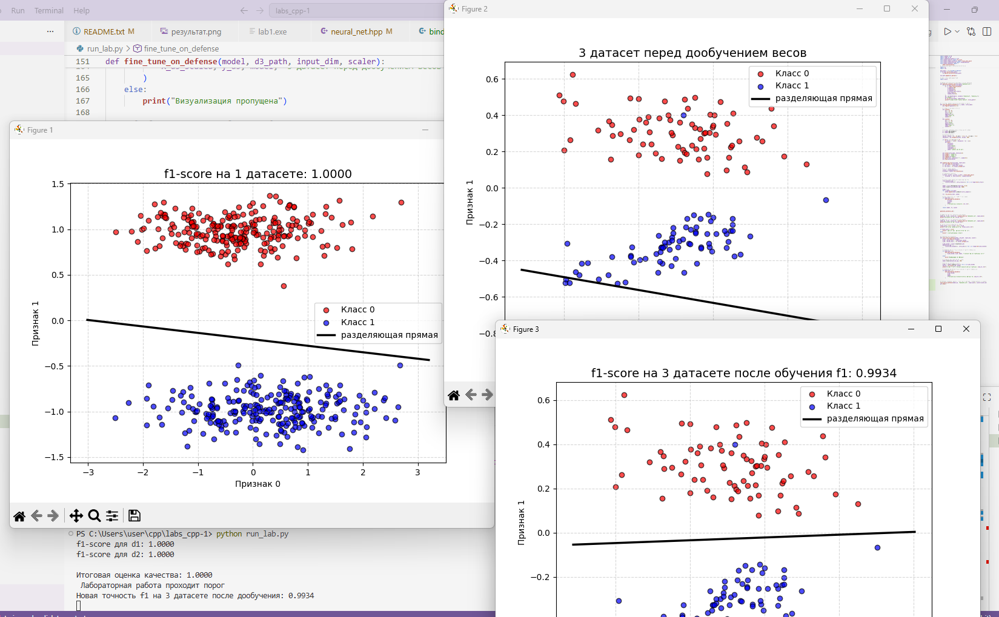

# Отчет по лабораторной работе 3-4

В ходе выполнения работы были произведены архитектурные изменения проекта:
1. **Поддержка динамической размерности признаков** 
Архитектура классификатора была полностью переведена на динамические массивы std::vector. Благодаря этому класс перцептрона теперь способен работать с входными данными любой размерности. 
2. **Создание кросс-платформенного модуля binding.cpp** 
С помощью библиотеки pybind11 связаны c++ и python. Написана обертка для конвертации списков python в типизированные `std::vector<Point<float>>`. Модуль компилируется в динамическую библиотеку my_nn.pyd.
3. **Обновление пайплайна выполнения**
 Файлы main и visualize объединены в единый скрипт, выполняющий загрузку данных, предобработку, управление c++ моделью и интерактивную визуализацию.

## Было реализовано:

1. **Работа с реальными и искусственными данными динамического размера**
   В отличие от предыдущей версии, архитектура переведена на динамические векторы. Модель теперь способна обрабатывать выборки произвольной размерности. Обучение и валидация успешно проведены на двух базовых датасетах: 'dataset1.csv' (2 признака) и 'dataset2.csv' (4 признака). Дополнительно реализована автоматическая генерация сложного синтетического датасета 'dataset3.csv' с помощью `sklearn.datasets.make_classification` для подготовки к защите лабораторной работы.

2. **Нормализация данных**
   Вместо ручного масштабирования внедрен класс `StandardScaler` из библиотеки `scikit-learn`.

3. **Разделение выборки**
   Используется функция `train_test_split` в соотношении 80/20. Это позволяет объективно оценить обобщающую способность модели на объектах, которые она не видела в процессе обучения.

4. **Метрика качества классификации**
   В качестве главного критерия успешности модели выбрана метрика `f1-score`. Итоговая оценка лабораторной работы рассчитывается по формуле:
   final_score = 0.5 * f1_d1 + 0.5 * f1_d2
   Модель с запасом преодолевает установленный порог в 0.55, демонстрируя результаты ~0.98-1.00.

5. **Визуализация**
   Реализована отрисовка разделяющей прямой c использованием библиотеки `matplotlib`.

---

### Результаты работы программы
